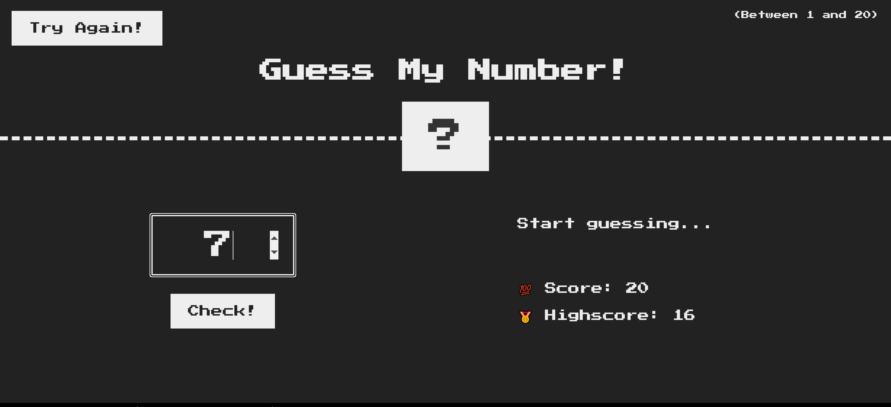

# Retro-Number-Guesser

## Description

A very simple retro-styled number guessing game I built using HTML, CSS, and vanilla JavaScript to review the fundamentals of DOM manipulation. This project was inspired by Jonas Schmedtmann's Udemy JavaScript course project.

.jpeg>)

## Questions:

Feel free to contact me at mully7773@gmail.com if you have any questions.  
You can view more of my projects at https://github.com/Mully7773.

## License:

This project is licensed under MIT.
